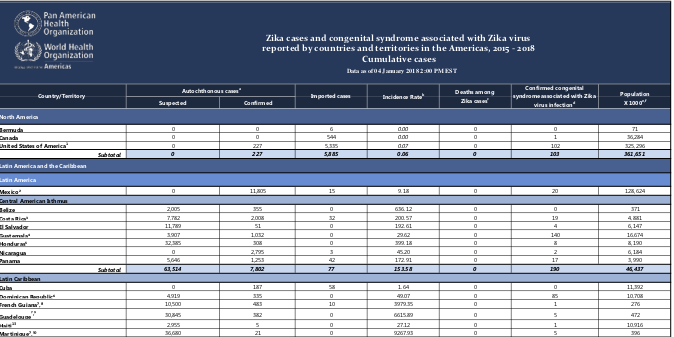

Parsing Public Health PDF's
========================================================
author: Collin Schwantes
date: 04 February 2019
css: custom.css

https://github.com/collinschwantes/GeoDCPublicHealthPDFs

Why Should I care? 
========================================================
 
- Ebola
- Zika
- Vaccine preventable diseases
- Lead levels

Why PDFs?
========================================================

### PDF's are EVERYWHERE in Govt. and especially in Public Health
- World Health Organization
- Minstry of Health Madagascar
- Your local public health department*
  - * willing to bet you a beer

Why Are PDF's hard to work with?
========================================================

- Designed to be human readable
- Designed to be printed
- Generally not designed as a machine-readable data store

But isn't the XML uniform and manipulatable?
========================================================
# Not really


So you're just manipulating strings?
========================================================
Hopefully!


What are my options?
========================================================
- PDFTools - text based pdfs
- Tabulizer - Java-based tool with R wrapper
- Tesseract - OCR without leaving R 

Why use OCR?
========================================================

- PDFs and websites often contain content in images
- Adobe OCR works pretty well for tables sometimes 
- Tesseract can provide a programtic way of extracting text 

An Example: OCR
================


An Example: OCR
==================


***
- Health Zones nested in provinces
- Case status nested in category "cumulative"
- Different colors
- French (bias is in training data is real)
- Sparse text

What can go wrong: OCR Tesseract
========================================================

## I TRIED
it is finnicky, the params list is a mile long

```
SITUATION EPIDEMIOLOGIQUE MALADIE A VIRUS EBOLA (03/02/2019)

D mo fr este
en À 2) 0) +)
Biens À" + GC
tee À 56 GE
Goma À  " 0Ù "GE CE
tan À CC
kate À fus nu <
aire À GC
kyonco À") | UT
ere À" "0 "GS 
```


How to fix: OCR issues
========================================================
Read the documentation 
- [docs](https://github.com/tesseract-ocr/tesseract/wiki/ControlParams)
- [tutorial](http://www.joyofdata.de/blog/a-guide-on-ocr-with-tesseract-3-03/)
- Preprocess your image
- train a new engine with data from your region of interest

How to fix: OCR result
=========================================================

Before

```
SITUATION EPIDEMIOLOGIQUE MALADIE A VIRUS EBOLA (03/02/2019)

D mo fr este
en À 2) 0) +)
Biens À" + GC
tee À 56 GE
Goma À  " 0Ù "GE CE
tan À CC
kate À fus nu <
aire À GC
kyonco À") | UT
ere À" "0 "GS 
```
***
After - needs improvement

```
SITUATION EPIDEMIOLOGIQUE MALADIE A VIRUS EBOLA (03/02/2019)
Ben | 2 est sf"
ere À 5
Bates À" 58
Goma À} Ù GE CO
lune À © 2
ee À CO
as À SC
yon À "24 ©
ere "À" "0 GC
Mabataee À 20) 2
Margunee 5 GC CO
```


Other OCR Tricks: Cropping
=======================================================

***

```
Beni

Biena
Butembo
Goma
Kalunguta
Katwa
Kayina
Kyondo
Lubero
Mabalako
Mangurujipa
Masereka
Musienene
Mutwanga
Oicha
Vuhovi
Komanda
Mandima
Nyankunde
Tchomia
```


Tabulizer
========================================================

If you can get java JDK and R to connect properly it probably works great. [Troubleshooting docs](https://github.com/ropensci/tabulizer#installing-java-on-windows-with-chocolatey) from the great folks at ROpenSci


PDFTools
==========================================

"Utilities based on 'libpoppler' for extracting **text**, fonts, attachments and metadata from a PDF file. Also supports high quality rendering of PDF documents into PNG, JPEG, TIFF format, or into raw bitmap vectors for further processing in R"

- great for getting text from pdf's
- can also be used for getting images embedded in PDF

PDFTools: PAHO Example
=========================================




PDFTools: PAHO Example
======================================
*Before you start, review [regex](https://github.com/rstudio/cheatsheets/raw/master/regex.pdf) 


```r
library(pdftools)
library(stringr)
library(dplyr)
library(purrr)
library(httr)

PahoDF <- GET(url = "https://www.paho.org/hq/index.php?option=com_docman&view=download&category_slu=cumulative-cases-pdf-8865&alias=43296-zika-cumulative-cases-4-january-2018-296&Itemid=270&lang=en")

PDFraw <- content(x = PahoPDF,as = "raw")

writeBin(object = PDFraw, con = "./ExamplePDFs/Paho.pdf")


pathPAHO <- list.files(path = "./ExamplePDFs",pattern = "Paho.pdf",full.names = T)

pdf_text(pdf = "./examplePDFs/Paho.PDF")
```


PDFTools: PAHO Example
======================================


```
[1] "Bermuda                                                                   0                                0                          6                             0.00                         0                               0                               71\nCanada                                                                    0                                0                         544                            0.00                         0                               1                            36,284\nUnited States of America1                                                 0                              227                        5,335                           0.07                         0                              102                          325,296\n                                          Subtotal                       0                               227                       5,885                            0.06                         0                              103                          361,651\nLatin America and the Caribbean\nLatin America\nMexico²                                                                   0                             11,805                        15                            9.18                         0                               20                          128,624\nCentral American Isthmus\nBelize                                                                 2,005                             355                          0                            636.12                        0                               0                              371\nCosta Rica³                                                            7,782                            2,008                         32                           200.57                        0                               19                            4,881\nEl Salvador                                                           11,789                              51                          0                            192.61                        0                               4                             6,147\nGuatemala⁴                                                             3,907                            1,032                         0                             29.62                        0                              140                           16,674\nHonduras⁵                                                             32,385                             308                          0                            399.18                        0                               8                             8,190\nNicaragua                                                                 0                             2,795                         3                             45.20                        0                               2                             6,184\nPanama                                                                 5,646                            1,253                         42                           172.91                        0                               17                            3,990\n                                          Subtotal                    63,514                            7,802                        77                           153.58                         0                              190                           46,437\nLatin Caribbean\nCuba                                                                      0                              187                          58                            1.64                         0                               0                            11,392\nDominican Republic⁶                                                    4,919                             335                          0                             49.07                        0                               85                           10,708\nFrench Guiana⁷,⁸                                                      10,500                             483                          10                          3979.35                        0                               1                              276\nGuadeloupe\n               ⁷,⁹                                                    30,845                             382                          0                           6615.89                        0                               5                              472\nHaiti13                                                                2,955                               5                          0                             27.12                        0                               1                            10,916\nMartinique⁷,¹⁰                                                        36,680                              21                          0                           9267.93                        0                               5                              396\nPuerto Rico¹¹                                                             0                             40,562                       137                          1101.93                        5                               47                            3,681\nSaint Barthelemy\n                     ⁷                                                 1,005                              61                          0                          10660.00                        0                               0                               10\n                ⁷,¹²\nSaint Martin                                                           3,283                             200                          0                           9675.00                        0                               1                               36\n                                          Subtotal                    90,187                           42,236                       205                           349.52                         5                              145                           37,887\nAndean Area\nBolivia (Plurinational State of)                                       2,672                             811                          4                             31.75                        0                               14                           10,971\nColombia¹⁴                                                            98,803                            9,927                         0                            223.49                        0                              248                           48,650\nEcuador¹⁵                                                              3,954                            2,397                         15                            38.48                        0                               14                           16,506\nPeru¹⁶                                                                 7,597                            1,530                         22                            28.55                        0                               0                            31,970\nVenezuela (Bolivarian Republic of)                                    60,146                            2,413                         0                            198.49                        0                               0                            31,518\n                                          Subtotal                   173,172                           17,078                        41                           136.27                         0                              276                          139,615\nBrazil17                                                              231,725                          137,288                        0                            176.10                       11                             2,952                         209,553\nSouthern Cone\nArgentina18                                                             539                              278                          41                            1.85                         0                               5                            44,060\nChile                                                                     0                                0                          34                            0.00                         0                               0                            18,131\nParaguay¹⁹                                                              715                               20                          0                             10.93                        0                               2                             6,725\nUruguay                                                                   0                                0                          1                             0.00                         0                               0                             3,444\n                                          Subtotal                     1,254                             298                         76                             2.14                         0                               7                            72,360\nNon-Latin Caribbean\nAnguilla                                                                 31                               23                          1                            317.65                        0                               0                               17\nAntigua and Barbuda20                                                   540                               25                          2                            601.06                        0                               0                               94\nAruba                                                                  1,208                             703                          7                           1676.32                        0                               0                              114\nBahamas21                                                               531                               25                          3                            140.76                        0                               0                              395\nBarbados²²                                                              715                              150                          0                            296.23                        0                               1                              292\nBonaire, St Eustatius and Saba23                                        235                              437                          0                           2688.00                        0                               0                               25\nCayman Islands24                                                        237                               30                          11                           460.34                        0                               0                               58\nCuracao25                                                              4,476                            2,049                         0                           4379.19                        0                               0                              149\nDominica                                                               1,154                              79                          0                           1666.22                        0                               0                               74\nGrenada                                                                 335                              118                          0                            408.11                        0                               2                              111\nGuyana26                                                                  0                               37                          0                             4.79                         0                               3                              773\nJamaica                                                                7,772                             203                          0                            284.01                        0                               0                             2,808\nMontserrat                                                               18                                5                          0                            460.00                        0                               0                               5\nSaint Kitts and Nevis                                                   554                               33                          0                           1107.55                        0                               0                               53\nSaint Lucia                                                             822                               50                          0                            528.48                        0                               0                              165\nSaint Vincent and the Grenadines                                        508                               83                          0                            579.41                        0                               0                              102\nSint Maarten (Dutch part)                                               253                              149                          0                            957.14                        0                               0                               42\nSuriname                                                               2,768                             724                          0                            637.23                        4                               4                              548\nTrinidad and Tobago27                                                     0                              718                          1                             52.52                        0                               17                            1,367\nTurks and Caicos Islands                                                203                               25                          3                            438.46                        0                               0                               52\nVirgin Islands (UK)                                                      74                               53                          0                            362.86                        0                               0                               35\nVirgin Islands (US)                                                    1,165                            1,024                         2                           2125.24                        0                               0                              103\n                                          S"
```

PDFTools: PAHO Example
======================================


```
[1] "Costa Rica³                                                            7,782                            2,008                         32                           200.57                        0                               19                            4,881"
[2] "Guadeloupe"                                                                                                                                                                                                                                                          
[3] "               ⁷,⁹                                                    30,845                             382                          0                           6615.89                        0                               5                              472" 
[4] "Brazil17                                                              231,725                          137,288                        0                            176.10                       11                             2,952                         209,553"
```

PDFTools: PAHO Example
======================================


```
# A tibble: 52 x 8
   Country      Suspected Confirmed Imported Incidence Deaths ZikaCS Pop  
   <chr>        <chr>     <chr>     <chr>    <chr>     <chr>  <chr>  <chr>
 1 Bermuda      0         0         6        0.00      0      0      71   
 2 Canada       0         0         544      0.00      0      1      36284
 3 United Stat… 0         227       5335     0.07      0      102    3252…
 4 Mexico       0         11805     15       9.18      0      20     1286…
 5 Belize       2005      355       0        636.12    0      0      371  
 6 Costa Rica   7782      2008      32       200.57    0      19     4881 
 7 El Salvador  11789     51        0        192.61    0      4      6147 
 8 Guatemala    3907      1032      0        29.62     0      140    16674
 9 Honduras     32385     308       0        399.18    0      8      8190 
10 Nicaragua    0         2795      3        45.20     0      2      6184 
# ... with 42 more rows
```
