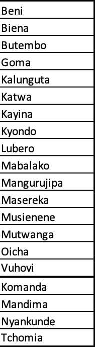

Parsing Public Health PDF's
========================================================
author: Collin Schwantes
date: 04 February 2019
css: custom.css

Why Should I care? 
========================================================
 
- Ebola
- Hantavirus
- Vaccine preventable diseases
- lead poisoning

Why PDFs?
========================================================

### PDF's are EVERYWHERE in Govt. and especially in Public Health
- World Health Organization
- Minstry of Health Madagascar
- Your local public health department*
  - * willing to bet you a beer

Why Are PDF's hard to work with?
========================================================

- Designed to be human readable
- Designed to be printed
- Generally not designed as a machine-readable data store

But isn't the XML uniform and manipulatable?
========================================================
# Not really


So you're just manipulating strings?
========================================================
Hopefully!


What are my options?
========================================================
- PDFTools - text based pdfs
- Tabulizer - Java-based tool with R wrapper
- Tesseract - OCR without leaving R 

Why use OCR?
========================================================

PDFs and websites often contain content in images.
- most OCR works best in dense text settings
- Adobe OCR works pretty well for tables sometimes 
- Tesseract in R requires a lot of finessing

An Example: OCR
==================


***
- Health Zones nested in provinces
- Case status nested in category "cumulative"
- Different colors
- French (bias is in training data is real)
- Sparse text

What can go wrong: OCR Tesseract
========================================================

## I TRIED
it is finnicky, the params list is a mile long

```
SITUATION EPIDEMIOLOGIQUE MALADIE A VIRUS EBOLA (03/02/2019)

D mo fr este
en À 2) 0) +)
Biens À" + GC
tee À 56 GE
Goma À  " 0Ù "GE CE
tan À CC
kate À fus nu <
aire À GC
kyonco À") | UT
ere À" "0 "GS 
```


How to fix: OCR issues
========================================================
Read the documentation 
- [docs](https://github.com/tesseract-ocr/tesseract/wiki/ControlParams)
- [tutorial](http://www.joyofdata.de/blog/a-guide-on-ocr-with-tesseract-3-03/)
- Preprocess your image
- train a new engine with data from your region of interest

How to fix: OCR result
=========================================================

Before

```
SITUATION EPIDEMIOLOGIQUE MALADIE A VIRUS EBOLA (03/02/2019)

D mo fr este
en À 2) 0) +)
Biens À" + GC
tee À 56 GE
Goma À  " 0Ù "GE CE
tan À CC
kate À fus nu <
aire À GC
kyonco À") | UT
ere À" "0 "GS 
```
***
After - needs improvement

```
SITUATION EPIDEMIOLOGIQUE MALADIE A VIRUS EBOLA (03/02/2019)
Ben | 2 est sf"
ere À 5
Bates À" 58
Goma À} Ù GE CO
lune À © 2
ee À CO
as À SC
yon À "24 ©
ere "À" "0 GC
Mabataee À 20) 2
Margunee 5 GC CO
```


Other OCR Tricks: Cropping
=======================================================

***

```
Beni

Biena
Butembo
Goma
Kalunguta
Katwa
Kayina
Kyondo
Lubero
Mabalako
Mangurujipa
Masereka
Musienene
Mutwanga
Oicha
Vuhovi
Komanda
Mandima
Nyankunde
Tchomia
```


Tabulizer
========================================================

If you can get java JDK and R to connect properly it probably works great. [Troubleshooting docs](https://github.com/ropensci/tabulizer#installing-java-on-windows-with-chocolatey) from the great folks at ROpenSci


PDFTools
==========================================

"Utilities based on 'libpoppler' for extracting **text**, fonts, attachments and metadata from a PDF file. Also supports high quality rendering of PDF documents into PNG, JPEG, TIFF format, or into raw bitmap vectors for further processing in R"

- great for getting text from pdf's
- can also be used for getting images embedded in PDF

PDFTools : PAHO Example
=========================================

*Before you start, review [regex](https://github.com/rstudio/cheatsheets/raw/master/regex.pdf) 

![PAHO][(./examplePDFs/Paho.png)
